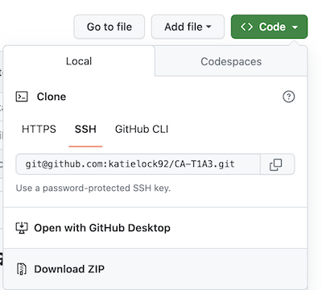
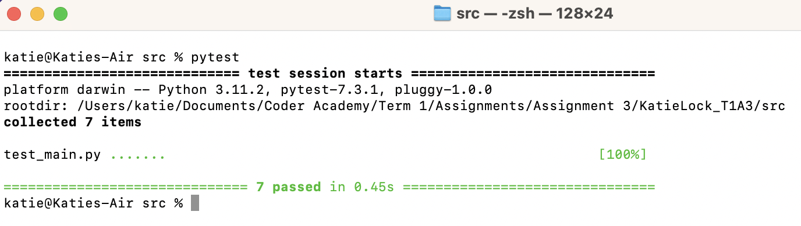

# Terminal Application (_Coder Academy Term 1 Assignment 3_)

### _Prepared by Katie Lock_

## Contents

1. [Links](#links)
2. [Help Documentation](#help-documentation)
3. [Initial App Idea and Features](#initial-app-idea-and-features)
4. [Implementation Plan](#implementation-plan)
5. [Timeline and Prioritisation](#timeline-and-prioritisation)
6. [Packages](#packages)
7. [Testing and TDD](#testing-and-tdd)
8. [Code Styling Guide](#code-styling-guide)
9. [Sources](#sources)

---

## Links

- GitHub repo: https://github.com/katielock92/CA-T1A3
- Presentation: https://www.loom.com/share/301927493cbc44eba411ed480705e228
- Trello board: https://trello.com/b/93Hv7cLh/t1a3-terminal-application-project-management

---

## Help Documentation

To run this application, please follow the steps below:

### System and Hardware Requirements

- This application can be run on any modern operating system that has a Terminal application, such as:
  - Mac
  - Windows
  - Linux
- There are no minimum hardware requirements
- You will need to have Python3 installed:
  - You can check if Python3 is installed by opening the terminal app and entering:
    ```
    python3 --version
    ```
  - If Python is not installed, go to the [official website](https://www.python.org/downloads/) to download

### How to Download

- On the source repository, press the green **Code** button and select **Download ZIP**:
  
- Once the ZIP file has downloaded to your local machine, open/unzip the file
- If desired, move the contents to the preferred location on your computer

### How to Run Program

There are two ways to run the application, depending on your operating system.

**For Windows users only:**

- In the location where you downloaded/moved the application to, open the src folder
- Right-click the "run.sh" file and select _Run as Program_

**For all operating systems:**

- Open the Terminal application
- Enter `pwd` to see your current location
- Enter `cd/"path"`, replacing `"path"` with the file path to where the src folder is located on your machine, relative to your current location - for example `"Documents/Apps/src"`
- For the first time you run the application, enter `chmod +x run.sh `
- Enter `./run.sh`

The program should now install any required modules, and then welcome you to the app.  The app will guide you through the expected input, and no command line knowledge is required once you are in the app.  Most input fields will accept the use of "quit" to gracefully exit the application at any point.

---

## Initial App Idea and Features

My app idea and features were posted onto Discord on 22 April 2023 for educator approval:

> _My app idea is inspired by the WFDF Rules Accreditation (https://rules.wfdf.org/accreditation) for Ultimate Frisbee, but to make a simplified terminal application (and making sure the questions are in plain English without double negatives like the real version - my pet peeve!!!)_

> _The features of this app would be:_
>
> - _User registration - users are required to sign in or sign up for the app using a unique email address._
> - _Quiz - the main part of the app! The users will be given a random selection of multi-choice questions from a linked csv file. The questions will be answered via user input. Their scores will be kept and they will be given their grade at the end._
> - _Register of certified players - if a passing score is registered, the user will be added to another file which contains all players who have successfully passed the quiz, along with the date that the test was passed._

> _Open to a different idea if you think it could be an IP issue, though I have contacts at WFDF if a clearance from them would help!_

This idea was approved by Simon:


---

## Implementation Plan

Before writing any code or creating a timeline for implementation, I firstly need to scope out the features I listed in my idea above. This will help conceptualise _how_ each feature works logically, breaking down all possible steps or paths within a feature, and whether anything was missed in my initial pitch that Simon approved.

Due to the depth in the Quiz feature of the app, this has been split to a separate page in the flowchart to assist with ease of reading:


One new feature was added when building this flowchart - **Previous Results**. This will allow users to see to see their own previous attempts at the quiz, rather than only being able to see if they were previously successful through the Certified Players feature.

There are now **five** features identified within my application, each with a varying scope:

1. User registration and login
2. Main menu
3. Quiz
4. User's previous results
5. Certified players

### **User registration and login**

To enable the quiz to having meaning and justify features 4 and 5, the application's first feature is to request users to login or register. This section of the application occurs before the user can access the main menu.

In order to implement this feature, the following tasks and code are required:

- a _system exit_ command, allowing a user to gracefully exit the application at any time
- an _input prompt_ for the user to provide their email address
- checking this input against an existing .csv file of registered users:
  - _if_ the user's email address is already registered, a _loop_ will begin:
    - an _input prompt_ will display, asking for their password:
      - _if_ this password is correct and matches the registered users file, they will receive a success message and move to the main menu, ending the _loop_
      - _else_ the password provided is incorrect, they will receive a message on screen and are asked to try again (_loop_ restarts)
  - _if_ the user's email is _not_ registered, a different _loop_ will begin:
    - an _input prompt_ will display, asking them to provide a password to sign up
    - this password will be checked to ensure it is in a valid format:
      - _if_ the password is valid, the user is successfully signed up:
        - a _random_ User ID is generated and assigned to this user
        - the user's email address, password and User ID is _written_ to the registered users _.csv_ file
        - the user will receive a success message and move to the main menu, ending the _loop_
      - _else_ the password provided is invalid, they will be asked to try again (_loop_ restarts)

### **Main menu**

Once the user is successfully logged in or registered, all remaining features on the app act off a loop from the main menu.

The tasks and code required here are:

- an outer _loop_:
  - the menu options are listed on the screen
  - an _input prompt_ asks the user to enter the corresponding number for their chosen menu option:
    - _if_ 1 is selected, this will trigger the quiz _function_ (see more detail below)
    - _else if_ 2 is selected, this will trigger the previous results _function_ (see more detail below)
    - _else if_ 3 is selected, this will trigger the certified players _function_ (see more detail below)
    - _else if_ 4 is selected, a _system exit_ command will occur, gracefully exiting the application
    - _else_ an invalid prompt is entered, the user will receive an error prompt on screen and they will be asked to try again (_loop_ restarts)

### **Quiz**

If option 1 is selected from the main menu:

- a new inner _quiz loop_ will commence:
  - _if_ at any time the quit command is entered, this will override any other function:
    - a display message will advise the user that quitting while the quiz is in progress will result in their progress being lost
    - an _input prompt_ will ask the user to confirm that they want to quit:
      - _if_ the user confirms to quit, a _system exit_ command will occur, gracefully exiting the application
      - _else_ any other input received, a message will display confirming that the quiz will not quit, and the application will go back to where it was previously
  - the question count will be checked to confirm it is <= 20:
    - _if_ true, a question will be selected at random from the quiz questions file, and a _question loop_ will begin:
      - an _input prompt_ will ask the user to return a multi-choice answer:
        - _if_ the correct answer is received, a count will be added to the user score and the _quiz loop_ will continue
        - _else if_ the incorrect answer is received, no count will be added to the user score and the _quiz loop_ will continue
        - _else_ an invalid response is entered, the user is displayed a message and the _question loop_ will continue
    - once the question count reaches > 20:
      - check if there is an existing .csv file for previous results
        - _if not_, create a new file
      - the user's score is the date is added to the previous results file
      - _if_ the user received a passing score:
        - write their user ID and the date to the certified players file
        - display the user score and outcome of the quiz
        - an _input prompt_ asking if the user wants to return to the main menu:
          - _if_ main menu, return to start of outer loop
          - _else_ a _system exit_ command will occur, gracefully exiting the application
      - _else_ the user did not receive a passing score:
        - display the user score and outcome of the quiz
        - an _input prompt_ asking if the user wants to try again
          - _if_ yes, return to the start of the _quiz loop_
          - _else_ return to the main menu (_outer loop_)

### **User's previous results**

If option 2 is selected from the main menu:

- a new inner _loop_ will commence:
  - check _if_ there is a previous results file for this user:
    - _if_ there is a previous results file, display the contents to the user
    - if there is _not_ a previous results file, display a message to the user
  - an _input prompt_ asking if the user wants to return to the main menu:
    - _if_ main menu, return to start of outer loop
    - _else_ a _system exit_ command will occur, gracefully exiting the application

### **Certified players**

If option 3 is selected from the main menu:

- the contents of the certified players file will be displayed to the user
- an _input prompt_ asking if the user wants to return to the main menu:
  - _if_ main menu, return to start of outer loop
  - _else_ a _system exit_ command will occur, gracefully exiting the application

---

### **Timeline and Prioritisation**

Due to a combination of each feature's priority, complexity and relationship with other features, I plan to prioritise the initial development of features in the following order:

1. _Main menu_ - this serves as the main loop for 3 of the other features, but has no dependency on the registration/login feature being developed first. This feature is also the only feature not to include any file handling, so is a simple starting point to commence development.
2. _User registration and login_ - as the 3 remaining features rely on data captured or validated in this feature, we need this feature operational first before we can commence development on those.
3. _Quiz_ - this is the flagship feature of our application, and it would serve little purpose without it. The main menu and registration/login lay the foundations for the user experience, but it's important that the quiz itself is operational for our app to have purpose.
4. _User's previous results_ - this feature provides context and confirmation that the data writing from the quiz is working as expected, and allows the user to validate previous interactions with the app. It's prioritised below the other features as it is not as essential, though still beneficial.
5. _Certified players_ - this feature is prioritised last as it serves as a "nice to have" and would be beneficial if we have time, though is limited in scope while there is no server for our application.

Now that the feature priorities have been established, a project management board can be set up. I have opted to use Trello due to my existing experience with it, along with the fact that the basic version is free. In addition to being included in the "Links" section, you can access my Trello board [here](https://trello.com/b/93Hv7cLh/t1a3-terminal-application-project-management).

This board is public and the full history of my updates can be seen and the timeframes I assigned for each task. Due to the number of cards and updates I am opting not to include screenshots, as this Trello board will remain public.

While I did try to use the original prioritisation of features, I often did jump between if there was a common feature to utilise, or as I thought of new approach. Overall the Quiz feature took the longest to complete due to the larger complexity within it.

---

## **Packages**

In addition to the use of variables, loops, control flow and functions (to make the above features happen), we need to utilise Python packages. For this assessment, we need to import at least **four** Python packages and _extensively use_ functions from at least one of these.

The following default Python packages have been used in my application:

- **csv:**
  - _Purpose:_ to allow us to create, read and write to .csv files in our application.
  - _URL:_ https://docs.python.org/3/library/csv.html#module-csv
- **re:**
  - _Purpose:_ stands for "regular expressions", allows us to use special characters without invoking their meaning. Utilised for validating email address and password formats.
  - _URL:_ https://docs.python.org/3/library/re.html
- **datetime:**
  - _Purpose:_ to allow us to access the date and time of the user when they are running our application. This will us to write the date of quiz attempts into the .csv files that are then viewed in features 4 and 5.
  - _URL:_ https://docs.python.org/3/library/datetime.html#module-datetime
- **time:**
  - _Purpose:_ to allow us to use a function called "sleep" which pauses processing of code and can be used for UX purposes to give the user more time to read.
  - _URL:_ https://docs.python.org/3/library/time.html
- **random:**
  - _Purpose:_ to generate a random user ID for new users within a range (rather than assigning these in sequential order), along with selecting a random sample of questions for each quiz.
  - _URL:_ https://docs.python.org/3/library/random.html#module-random
- **venv:**
  - _Purpose:_ to allow us to run a virtual environment for the application.
  - _URL:_ https://docs.python.org/3/library/venv.html#module-venv
- **builtsins:**
  - _Purpose:_ to assist with testing.
  - _URL:_ https://docs.python.org/3/library/builtins.html
- **io:**
  - _Purpose:_ to assist with testing.
  - _URL:_ https://docs.python.org/3/library/io.html?highlight=io#module-io
- **unittest.mock:**
  - _Purpose:_ to assist with testing, allows us to create mock data.
  - _URL:_ https://docs.python.org/3/library/unittest.mock.html?highlight=unittest
- **os:**
  - _Purpose:_ to assist with testing, accesses operating system features.
  - _URL:_ https://docs.python.org/3/library/os.html

The following **non-default** packages have been used in my application:

- **pandas:**
  - _Purpose:_ a more advanced library for searching for working with .csv files in our application.
  - _URL:_ https://pypi.org/project/pandas/
- **colored:**
  - _Purpose:_ to allow us to use colours in our terminal application, making it easier for the user to operate given there is no GUI.
  - _URL:_ https://pypi.org/project/colored/
- **emoji:**
  - _Purpose:_ to allow for the use of emojis in our terminal application, for some added personality and visual elements.
  - _URL:_ https://pypi.org/project/emoji/
- **maskpass:**
  - _Purpose:_ to allow the user input of passwords to be concealed while they are typing.
  - _URL:_ https://pypi.org/project/maskpass/
- **pytest**
  - _Purpose:_ to test our code using unit tests.
  - _URL:_ https://docs.pytest.org/en/7.3.x/

___
## **Testing and TDD**

Another requirement of the application is that there are **at least TWO** tests. In an ideal world, we should follow Test-Driven Development (TDD) and write these tests prior to coding the features, so this needs to be factored into our timeline and prioritisation.

However when reviewing my features and what types of test cases I could run, there were not a large number of feasible test cases that could be written _before_ commencing development, given the app primarily operates through user inputs and file handling rather than too many operational functions. Therefore most tests were written after core development was complete, but continued to be checked when code was refactored to ensure they would still pass.

The unit tests through Pytest that I have prepared are as follows:

1. **Testing the Previous Results feature:**
   1. Confirms that when there are no previous results for a given user ID, the expected output displays
   2. Confirms that the correct text is returned when there are previous results for a given user ID
   3. Checks that a FileNotFound error occurs when the .csv file for previous results is missing
2. **Testing the Certified Players feature:**
   1. Confirms that the correct text is returned when the certified players file exists
   2. Checks that a FileNotFound error occurs when the .csv file for certified players is missing
3. **Testing the Check Email sub-feature of the Login feature:**
   1. Checks for expected results when a valid email is entered
   2. Checks for expected results when an invalid email is entered
4. **Testing the Menu Selection feature:**
   1. Checks that the expected error is thrown when non-integer input is received
5. **Testing the Fail Quiz sub-feature of the Quiz feature:**
   1. Confirms that the correct text is returned when a user fails the quiz
   2. Confirms that the results .csv file increases by one row when a user fails the quiz
   3. Checks that a FileNotFound error occurs when the .csv file for previous results is missing
6. **Testing the Pass Quiz sub-feature of the Quiz feature:**
   1. Confirms that the correct text is returned when a user passes the quiz
   2. Confirms that the results .csv file increases by one row when a user passes the quiz
   3. Checks that a FileNotFound error occurs when the .csv file for previous results is missing
   4. Confirms that the certified players .csv file increases by one row when a user passes the quiz
   5. Checks that a FileNotFound error occurs when the .csv file for certified players is missing
7. **Testing the Run Quiz sub-feature of the Quiz feature:**
   1. Checks the user score calculates as expected

At the time of submission, all tests are currently passing:


---

## Code Styling Guide

My application utilises the Google Python Styling Guide.
The full details of Google's styling guide is documented [here](https://google.github.io/styleguide/pyguide.html).

Some of the key elements of this styling guide that I implemented with my code are:

- start all module files with a docstring describing the content and usage of the module
- use import statements for packages and modules only, not for individual classes or functions
- import statements to sit at the top of the file, and grouped by most generic to least generic
- maximum line length of 80 characters (with some exceptions)
- indent code blocks with 4 spaces, not tabs
- use a docstring above all function that are have non-obvious logic
- use a docstring for all classes
- use f-strings for formatting strings where appropriate
- explicitly close all files
- one statement per line
- consistent naming conventions
- keep functions short and focused
- overall, be consistent!

---

## Sources

1. Google Python Style Guide (Google), https://google.github.io/styleguide/pyguide.html
2. Rules of Ultimate (World Flying Disc Association), https://rules.wfdf.org/