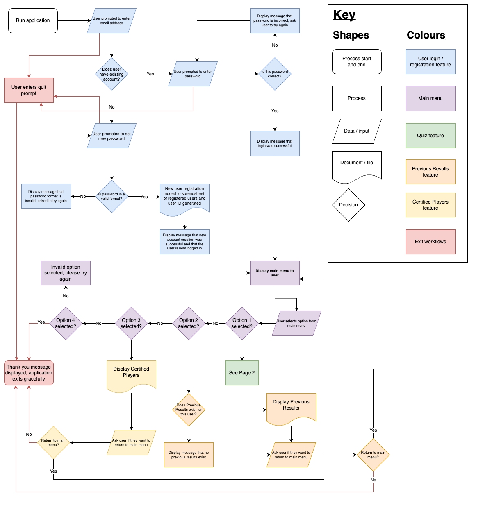
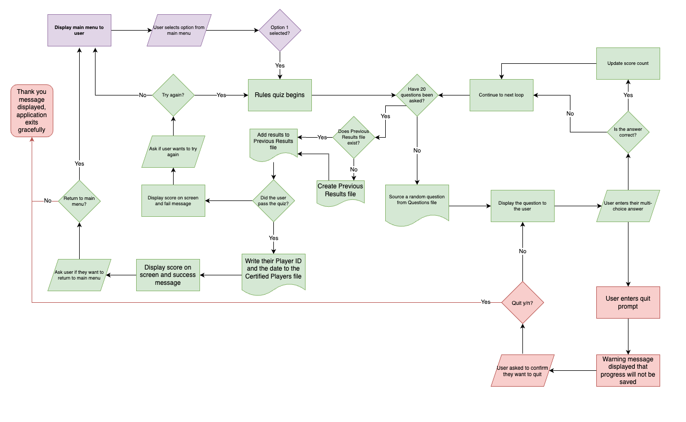

# Terminal Application (*Coder Academy Term 1 Assignment 3*)
### *Prepared by Katie Lock*

## Contents
xyz
___
## Links
xyz
___
## Features
My app idea and features were posted onto Discord on 22 April 2023 for educator approval:
> *My app idea is inspired by the WFDF Rules Accreditation (https://rules.wfdf.org/accreditation) for Ultimate Frisbee, but to make a simplified terminal application (and making sure the questions are in plain English without double negatives like the real version - my pet peeve!!!)*

> *The features of this app would be:*
> - *User registration - users are required to sign in or sign up for the app using a unique email address.*
> - *Quiz - the main part of the app! The users will be given a random selection of multi-choice questions from a linked csv file. The questions will be answered via user input. Their scores will be kept and they will be given their grade at the end.*
> - *Register of certified players - if a passing score is registered, the user will be added to another file which contains all players who have successfully passed the quiz, along with the date that the test was passed.*

> *Open to a different idea if you think it could be an IP issue, though I have contacts at WFDF if a clearance from them would help!*

This idea was approved by Simon:

___
## Implementation Plan
Before writing any code or creating a timeline for implementation, I firstly need to scope out the features I listed in my idea above.  This will help conceptualise *how* each feature works logically, breaking down all possible steps or paths within a feature, and whether anything was missed in my initial pitch that Simon approved.

Due to the depth in the Quiz feature of the app, this has been split to a separate page in the flowchart to assist with ease of reading:

One new feature was added when building this flowchart - **Previous Results**.  This will allow users to see to see their own previous attempts at the quiz, rather than only being able to see if they were previously successful through the Certified Players feature.

There are now **five** features identified within my application, each with a varying scope:
1. User registration and login
2. Main menu
3. Quiz
4. User's previous results
5. Certified players

### **User registration and login**
To enable the quiz to having meaning and justify features 4 and 5, the application's first feature is to request users to login or register.  This section of the application occurs before the user can access the main menu.

In order to implement this feature, the following tasks and code are required:
- an *except* error for the quit command, allowing a user to gracefully exit the application at any time
- an *input prompt* for the user to provide their email address
- checking this input against an existing .csv file of registered users:
    - *if* the user's email address is already registered, a *loop* will begin:
        - an *input prompt* will display, asking for their password:
            - *if* this password is correct and matches the registered users file, they will receive a success message and move to the main menu, ending the *loop*
            - *else* the password provided is incorrect, they will receive a message on screen and are asked to try again (*loop* restarts)
    - *if* the user's email is *not* registered, a different *loop* will begin:
        - an *input prompt* will display, asking them to provide a password to sign up
        - this password will be checked to ensure it is in a valid format:
            - *if* the password is valid, the user is successfully signed up:
                - a *random* User ID is generated and assigned to this user
                - the user's email address, password and User ID is *written* to the registered users *.csv* file
                - the user will receive a success message and move to the main menu, ending the *loop*
            - *else* the password provided is invalid, they will be asked to try again (*loop* restarts)

### **Main menu**
Once the user is successfully logged in or registered, all remaining features on the app act off a loop from the main menu.

The tasks and code required here are:
- an outer *loop*:
    - the menu options are listed on the screen
    - an *input prompt* asks the user to enter the corresponding number for their chosen menu option:
        - *if* 1 is selected, this will trigger the quiz *function* (see more detail below)
        - *else if* 2 is selected, this will trigger the previous results *function* (see more detail below)
        - *else if* 3 is selected, this will trigger the certified players *function* (see more detail below)
        - *else if* 4 is selected, an *except* error will occur, gracefully exiting the application
        - *else* an invalid prompt is entered, the user will receive an error prompt on screen and they will be asked to try again (*loop* restarts)

### **Quiz**
If option 1 is selected from the main menu:
- a new inner *quiz loop* will commence:
    - *if* at any time the quit command is entered, this will override any other function:
        - a display message will advise the user that quitting while the quiz is in progress will result in their progress being lost
        - an *input prompt* will ask the user to confirm that they want to quit:
            - *if* the user confirms to quit, an *except* error will occur, gracefully exiting the application
            - *else* any other input received, a message will display confirming that the quiz will not quit, and the application will loop back to where it was previously
    - the question count will be checked to confirm it is <= 20:
        - *if* true, a question will be selected at random from the quiz questions file, and a *question loop* will begin:
            - an *input prompt* will ask the user to return a multi-choice answer:
                - *if* the correct answer is received, a count will be added to the user score and the *quiz loop* will continue
                - *else if* the incorrect answer is received, no count will be added to the user score and the *quiz loop* will continue
                - *else* an invalid response is entered, the user is displayed a message and the *question loop* will continue
        - once the question count reaches > 20:
            - check if there is an existing .csv file for previous results
                - *if not*, create a new file
            - the user's score is the date is added to the previous results file
            - *if* the user received a passing score:
                - write their user ID and the date to the certified players file
                - display the user score and outcome of the quiz
                - an *input prompt* asking if the user wants to return to the main menu:
                    - *if* main menu, return to start of outer loop
                    - *else* an *except* error will occur, gracefully exiting the application
            - *else* the user did not receive a passing score:
                - display the user score and outcome of the quiz
                - an *input prompt* asking if the user wants to try again
                    - *if* yes, return to the start of the *quiz loop*
                    - *else* return to the main menu (*outer loop*)

### **User's previous results**
If option 2 is selected from the main menu:
- a new inner *loop* will commence:
    - check *if* there is a previous results file for this user:
        - *if* there is a previous results file, display the contents to the user
        - if there is *not* a previous results file, display a message to the user
    - an *input prompt* asking if the user wants to return to the main menu:
        - *if* main menu, return to start of outer loop
        - *else* an *except* error will occur, gracefully exiting the application
### **Certified players**
If option 3 is selected from the main menu:
- the contents of the certified players file will be displayed to the user
- an *input prompt* asking if the user wants to return to the main menu:
    - *if* main menu, return to start of outer loop
    - *else* an *except* error will occur, gracefully exiting the application

### **Packages**
In addition to the use of variables, loops, control flow and functions (to make the above features happen), we need to utilise Python packages.  For this assessment, we need to import at least **four** Python packages and *extensively use* functions from at least one of these.

The following packages will be used in our application:
- **csv:**
    - *Purpose:* to allow us to create, read and write to .csv files in our application.
    - *URL:* https://docs.python.org/3/library/csv.html#module-csv
- **datetime:** 
    - *Purpose:* to allow us to access the date and time of the user when they are running our application. This will us to write the date of quiz attempts into the .csv files in features 4 and 5.
    - *URL:* https://docs.python.org/3/library/datetime.html#module-datetime
- **random:**
    - *Purpose:* x
    - *URL:* https://docs.python.org/3/library/random.html#module-random
- **venv:**
    - *Purpose:* x
    - *URL:* https://docs.python.org/3/library/venv.html#module-venv
- **colored:**
    - *Purpose:* to allow us to use colours in our terminal application, making it easier for the user to operate given there is no GUI.
    - *URL:* https://pypi.org/project/colored/

___
## Help Documentation
xyz

___
## Sources
xyz
___
## Code Styling Guide
xyz

___
## Assignment Brief:
*To be removed once README.md is ready and completed*
### README Requirements:

1. Answer to all the documentation requirements below.

2. Your README.md should have a separate heading for each documentation requirement and answers organised under the appropriate headings.

3. Provide full attribution to the referenced sources (where applicable).

4. Provide a link to your source control repository.

5. Identify any code style guide or styling conventions that the application will adhere to. Reference the chosen style guide appropriately.

6. Develop a list of features that will be included in the application. It must include:
    - at least THREE features
    - describe each feature

    Note: Ensure that your features above allow you to demonstrate your understanding of the following language elements and concepts:
    - use of variables and the concept of variable scope
    - loops and conditional control structures
    - error handling

    Consult with your educator to check your features are sufficient.

7. Develop an implementation plan which:
    - outlines how each feature will be implemented and a checklist of tasks for each feature
    - prioritise the implementation of different features, or checklist items within a feature
    - provide a deadline, duration or other time indicator for each feature or checklist/checklist item

    Utilise a suitable project management platform to track this implementation plan. Provide screenshots/images and/or a reference to an accessible project management platform used to track this implementation plan.

    Your checklists for each feature should have at least 5 items.

8. Design help documentation which includes a set of instructions which accurately describe how to use and install the application.

    You must include:
    - steps to install the application
    - any dependencies required by the application to operate
    - any system/hardware requirements
    - how to use any command line arguments made for the application.

### Presentation Requirements:

A slide-deck must be created and video presentation recorded of you running through this slide deck.

This presentation much include:

- A walk-through of your Terminal application, its features and how it used
- A walk-through of the logic of your Terminal application and code (ensure to run through the important parts of your code, including any crucial application logic)
- A review of your development/build process including challenges, ethical issues, favourite parts, etc

The maximum time for the presentation is 10 minutes.

### Code Requirements:

- Implement features in the software development plan you have designed. You must utilise a range of programming concepts and structures using Python such as:
    - variables and variable scope
    - loops and conditional control structures
    - write and utilise simple functions **(FOR HD: SIX OR MORE WRITTEN, USE AT LEAST FIVE OF THESE)**
    - error handling
    - input and output **(FOR HD: TWO OR MORE)**
    - importing a Python package **(FOR HD: FOUR OR MORE)**
    - using functions from a Python package **(FOR HD: EXTENSIVE USE OF ONE OR MORE)**

- Apply DRY (Don’t Repeat Yourself) coding principles to all code produced.

- Apply all style and conventions for the programming language consistently to all code produced.

- Creates an application which runs without error and has features that are consistent with the development plan. **(FOR HD: NO ERRORS)**

- Design TWO tests which check that the application is running as expected.

    Each test should:
    - cover a different feature of the application
    - state what is being tested
    - provide at least TWO test cases and the expected results for each test case

    > An outline of the testing procedure and cases should be included with the source code of the application.

- Utilise source control throughout the development of the application by:
    - making regular commits (at least 20 commits) with a commit message that summarises the changes **(FOR HD: SIGNIFICANTLY MORE THAN 20 COMMITS)**
    - pushing all commits to a remote repository

- Utilise developer tools to facilitate the execution of the application.  For example: writing a script which turns the application into an executable.