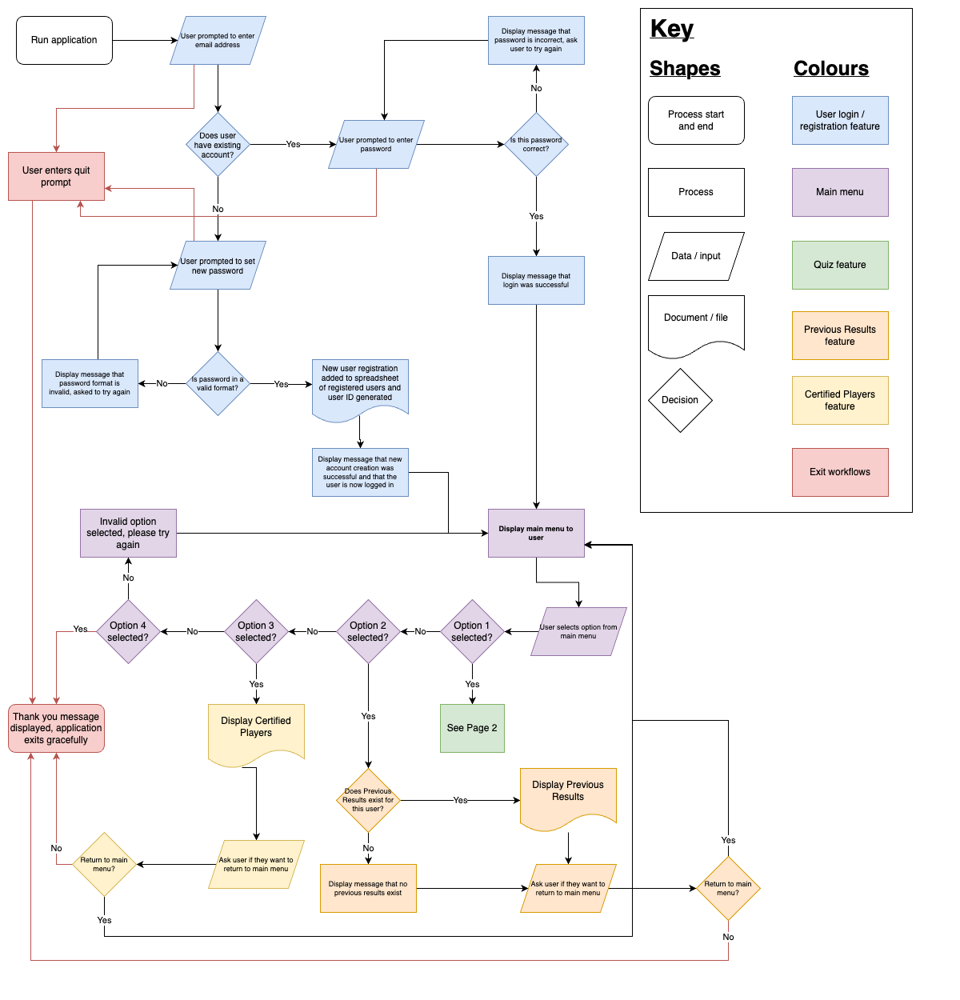
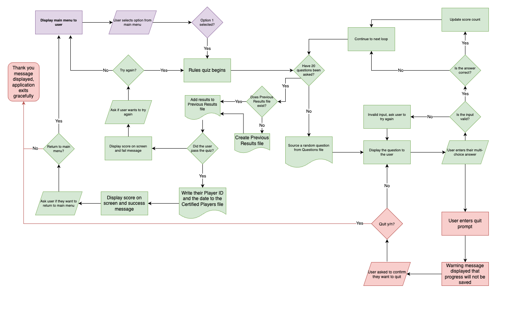

# Implementation Plan - T1A3 Katie Lock

## Stage One - Idea and Approval

My app idea was posted onto Discord on 22 April 2023 for educator approval:
> *My app idea is inspired by the WFDF Rules Accreditation (https://rules.wfdf.org/accreditation) for Ultimate Frisbee, but to make a simplified terminal application (and making sure the questions are in plain English without double negatives like the real version - my pet peeve!!!)*

> *The features of this app would be:*
> - *User registration - users are required to sign in or sign up for the app using a unique email address.*
> - *Quiz - the main part of the app! The users will be given a random selection of multi-choice questions from a linked csv file. The questions will be answered via user input. Their scores will be kept and they will be given their grade at the end.*
> - *Register of certified players - if a passing score is registered, the user will be added to another file which contains all players who have successfully passed the quiz, along with the date that the test was passed.*

> *Open to a different idea if you think it could be an IP issue, though I have contacts at WFDF if a clearance from them would help!*

This idea was approved by Simon:

Now that my app idea has been approved, the Implementation Plan needs to be prepared and loaded into a Project Management tool in order to track over the next two weeks.
___

## Stage Two - Feature Flowcharts
Before writing any code or creating a timeline for implementation, I firstly need to scope out the features I listed in my idea above.  This will help conceptualise *how* each feature works logically, breaking down all possible steps or paths within a feature.

Due to the depth in the Quiz feature of the app, this has been split to a separate page in the flowchart to assist with ease of reading:

One new feature was added when building this flowchart - **Previous Results**.  This will allow users to see to see their own previous attempts at the quiz, rather than only being able to see if they were previously successful through the Certified Players feature.
___

## Stage x - Feature Descriptions
There are **five** features identified within my application, each with a varying scope:
1. User registration and login
2. Main menu
3. Quiz
4. User's previous results
5. Certified players

### User registration and login
To enable the quiz to having meaning and justify features 4 and 5, the application's first feature is to request users to login or register.  This section of the application occurs before the user can access the main menu.

In order to implement this feature, the following tasks and code are required:
- an *except* error for the quit command, allowing a user to gracefully exit the application at any time
- an *input prompt* for the user to provide their email address
- checking this input against an existing .csv file of registered users:
    - *if* the user's email address is already registered, a *loop* will begin:
        - an *input prompt* will display, asking for their password:
            - *if* this password is correct and matches the registered users file, they will receive a success message and move to the main menu, ending the *loop*
            - *else* the password provided is incorrect, they will receive a message on screen and are asked to try again (*loop* restarts)
    - *if* the user's email is *not* registered, a different *loop* will begin:
        - an *input prompt* will display, asking them to provide a password to sign up
        - this password will be checked to ensure it is in a valid format:
            - *if* the password is valid, the user is successfully signed up:
                - a *random* User ID is generated and assigned to this user
                - the user's email address, password and User ID is *written* to the registered users *.csv* file
                - the user will receive a success message and move to the main menu, ending the *loop*
            - *else* the password provided is invalid, they will be asked to try again (*loop* restarts)

### Main menu
Once the user is successfully logged in or registered, all remaining features on the app act off a loop from the main menu.
### Quiz

### User's previous results

### Certified players

___
## Stage x - Planning Python Structures

Now that I have visualised the logic behind each feature using the flowcharts above, I can start to plan which Python structures I plan to use in order to meet the assessment requirements, and where.  This should make my coding time quicker, and increase the chances that my application will meet the rubric criteria of this assessment.

___
## Stage x - Planning Packages to Import

To meet the assessment requirements for this application, we need to import at least **four** Python packages and *extensively use* functions from at least one of these.

The following packages will be used in our application:
- **csv:**
    - Purpose: x
    - URL: https://docs.python.org/3/library/csv.html#module-csv
- **datetime:** 
    - Purpose: x
    - URL: https://docs.python.org/3/library/datetime.html#module-datetime
- **random:**
    - Purpose: x
    - URL: https://docs.python.org/3/library/random.html#module-random
- **venv:**
    - Purpose: x
    - URL: https://docs.python.org/3/library/venv.html#module-venv
- **colored:**
    - Purpose: 
    - URL: https://pypi.org/project/colored/

___
## Stage x - Creating the Timeline

[x]

